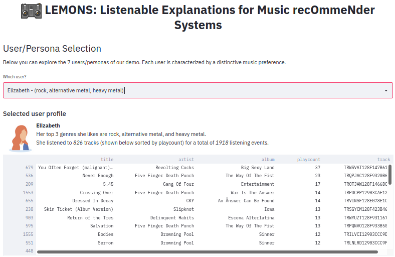

# LEMONS: Listenable Explanations for Music recOmmeNder Systems
**LEMONS** addresses the issue of explaining of why a track has been recommended to a user by providing listenable explanations based on the track itself.

## Overview

**LEMONS** consists of the following 2 parts: 

1. Music Recommender System. The RS is content-based and we trained one model for each of 7 users. 
2. Listenable Explanations. Explanations are computed post-hoc using [audioLIME](https://github.com/CPJKU/audioLIME), an extension of [LIME](https://arxiv.org/abs/1602.04938) for audio data.

The functionality is demonstrated using a [streamlit](https://www.streamlit.io/) app. A screenshot of the **LEMONS** app can be seen below.



You can check out the [video of our demo](https://www.youtube.com/watch?v=giSPrPnZ7mc) (~9 minutes).

In the following you can find the details to setup and conduct the same experiments and how to run the `streamlit` app to play around with the explanations.

## Setup

### Create an environment with all dependencies

```shell script
conda env create -f lemons.yml
conda activate lemons
```

### Install `lemons`
In the root directory, run the following:
```shell script
python3 setup.py develop
```
or, if it doesn't work
```shell script
pip install -e .
```

### Config

Some paths need to be set, e.g. to the location of your data.
Copy `config_template.py` to `config.py` and set your paths there. `config.py` is in `.gitignore` 
such that each user has their own config without overwriting the others.

## Training
Before training, it could be necessary to tune the following parameters.

We use [`sacred`](https://github.com/IDSIA/sacred) to log all experiments. In `local_conf` in `recsys/experiment.py`, change the following:
- mongodb_db_name 
```python
local_conf = {
    'mongodb_url': '',
    'mongodb_db_name': '',
    'experiment_name': '',
}
```

In `experiment_config()` in `recsys/experiment.py`, you can change the following parameters (commented):
```python
def experiment_config():
    # --Logging Parameters-- #

    uid = generate_uid()                        
    model_save_path = '../experiments/{}/'.format(uid)
    use_tensorboard = 0  # if also tensorboard (together with sacred) should be used
    log_step = 100 # how many batches have to pass before logging the batch loss (NB. this is not for avg_loss)

    # --Training Parameters-- #

    training_seed = 1930289 # seed used for training (independent of the data seed)
    model_type = 'base' # which model to train (check model.py to see the ones available)
    input_length = get_model_input_length(model_type) 
    model_load_path = '' # if load pre-trained model
    freeze = 1  # if freeze the weights of a pre-trained model
    batch_size = 20 # batch size
    n_epochs = 1000 # epochs for training
    lr = 1e-3 # learning rate
    wd = 1e-4 # weight decay
    num_workers = 10 # number of workers
    device = 'cuda:0' # which device to use

    # --Data Parameters-- #

    data_path = '' # path to the npys
    meta_path = '../data/' # path to the meta data
    user_name = 'marko' # users (check utils, get_user_id)
    user_id = get_user_id(user_name)
```
Then training can be run with:
```shell script
cd recsys
python3 experiment.py with seed=1057386
```
The best model will be saved by default in the directory /experiments/<date>.

## Testing

In local_conf in experiment.py, change the following:
- mongodb_db_name  (similar to above):
In experiment_config() in eval.py, you can change the following parameters (commented):
```python
def experiment_config():
    # --Logging Parameters-- #

    use_tensorboard = 1  # if also tensorboard (together with sacred) should be used

    # --Evaluation Parameters-- #

    model_type = 'base'  # which model to train (check model.py to see the ones available)
    input_length = get_model_input_length(model_type)
    model_load_path = 'best_model.pth'  # path to the trained model
    results_path = os.path.dirname(model_load_path) + "/results.pkl"  # TODO: not used for now
    batch_size = 20  # batch size
    num_workers = 10  # number of workers
    device = 'cuda:0'  # which device to use

    # --Data Parameters-- #

    data_path = ''  # path to the npys
    meta_path = '../data/'  # path to the meta data
    user_name = 'marko'  # users (check utils, get_user_id)
    user_id = get_user_id(user_name)
```
Then the evaluation can be run with:
```shell script
cd training/
python3 eval.py with seed=1057386
```
The results will be saved in the same directory of "model_load_path".

## Demo 

You can look at a demonstration using the `streamlit` app. 
It has to be run from the `lemons` root directory.

```
streamlit run explanations/lemons.py
```

## Audio-based Recommender System - Model and Training details
### Input
For training on the Million Song Dataset, we use snippets from 7digital. Snippet durations range from 30s to 60s.
Audios are downsampled to 16kHz and transformed in decibel mel-spectograms. We use 256 mel bins with a hop size of 512. Only for training, we train on 1s randomly selected part of the snippet, leading to the input shape of 256x63.

### Model
At the beginning of our model, we carry out batch normalization.
Afterwards, the inputs go through 5 layers of convolutions. Each convolution is followed by another batch normalization, ReLU, and Max Pooling.
The number of channels for the convolutions are: 1 -> 64 -> 128 -> 128 -> 64. Each maxpooling halves the width and height.
In the last layers, we perform global average pooling and global max pooling. The two output are then combined, passed throught dropout and a fully connected layer which outputs the logit relevance for the track.

### Training
We use a batch size of 20 and train for 1000 epochs with a learning rate of 1e-3, weight decay of 1e-4, and Adam optimizer.
We train a total of 7 models, one for each user. 

### Validation and Testing
For evaluation, we use as input the whole track.

## Experiments & Results

We split the tracks into train, validation,and test set in an 80-10-10 fashion and select the model that achieves the bestresults in terms of AUC and MAP on the validation set. The results on the testset averaged across the users are 0.734±0.130 MAP and 0.758±0.113 AUC.

### Stability of explanations
We select the number of samples N_s to get stable explanations by following the procedure described in [[Mishra2020]](https://arxiv.org/abs/2005.07788). Preliminary experiments on a subset of test examples (50 per user) showed that N_s=2^{11} suffices.

