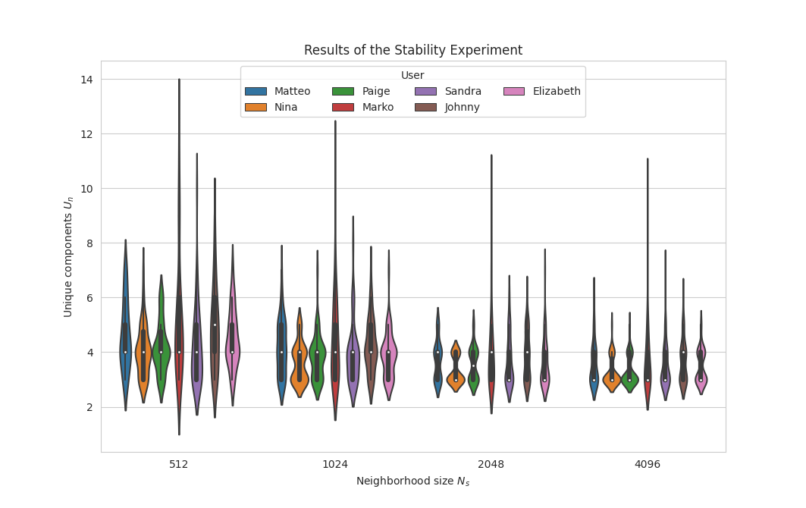

# LEMONS: Listenable Explanations for Music recOmmeNder Systems

**LEMONS** addresses the issue of explaining of why a track has been recommended to a user by providing listenable
explanations based on the track itself.

## Overview

**LEMONS** consists of 2 parts:

1. A Content-Based Music Recommender System. The Recommender System takes in input the audio tracks and outputs a
   relevance score for the user.
2. [audioLIME](https://github.com/CPJKU/audioLIME) for generating post-hoc listenable explanations for audio data.

The functionality is demonstrated using a [streamlit](https://www.streamlit.io/) app. A screenshot of the **LEMONS** app
can be seen below.


You can check out the [video of our demo](https://www.youtube.com/watch?v=giSPrPnZ7mc) (~9 minutes).

Below you can find the details about the recommender system, how to setup and conduct the same experiments
and how to run the `streamlit` app to play around with the explanations.

## Audio-based Recommender System - Model and Training details

### Input

For training on the Million Song Dataset, we use snippets from 7digital. Snippet durations range from 30s to 60s. Audios
are downsampled to 16kHz and transformed in decibel mel-spectograms. We use 256 mel bins with a hop size of 512. Only
for training, we train on 1s randomly selected part of the snippet, leading to input with shape of 256 X 63.

### Model

The structure of the audio-based recommender system is depicted below. 
| Layers                                        |
|-----------------------------------------------|
| BatchNorm2d                                   |
| Conv2d(1,64), BatchNorm2d, ReLU, MaxPool2d    |
| Conv2d(64,128), BatchNorm2d, ReLU, MaxPool2d  |
| Conv2d(128,128), BatchNorm2d, ReLU, MaxPool2d |
| Conv2d(128,128), BatchNorm2d, ReLU, MaxPool2d |
| Conv2d(128,64), BatchNorm2d, ReLU, MaxPool2d  |
| Cat(AdaptiveAvgPool2d + AdaptiveMaxPool2d)    |
| Dropout(0.5)                                  |
| Linear(128,1)                                 |

Convolutions have a kernel of 3x3 while MaxPooling halves in both dimensions each time. In the last layers we
concatenate global average pooling and global max pooling, apply dropout, and feed it to a linear layer.

### Training

We use a batch size of 20 and train for 1000 epochs with a learning rate of 1e-3, weight decay of 1e-4, and Adam
optimizer. We train a total of 7 models, one for each user.

### Validation and Testing

For evaluation, we use as input the whole track.

## Setup

### Create an environment with all dependencies

```shell script
conda env create -f lemons.yml
conda activate lemons
```

### Install `lemons`

In the root directory, run the following:

```shell script
python3 setup.py develop
```

or, if it doesn't work

```shell script
pip install -e .
```

### Config

Some paths need to be set, e.g. to the location of your data. Copy `config_template.py` to `config.py` and set your
paths there. `config.py` is in `.gitignore`
such that each user has their own config without overwriting the others.

Notice that it may be necessary to set up a small webserver in order to correctly show audios and images in the streamlit app.

## Training

Before training, it could be necessary to tune some parameters.

We use [`sacred`](https://github.com/IDSIA/sacred) to log all experiments. In `local_conf` in `recsys/experiment.py` you need to set the following parameters to correctly log experiments on mongodb. Check also [here](https://sacred.readthedocs.io/en/stable/observers.html#adding-a-mongoobserver).  


```python
local_conf = {
    'mongodb_url': '',
    'mongodb_db_name': '',
    'experiment_name': '',
}
```

In `experiment_config()` in `recsys/experiment.py`, you can change the following parameters:

- `use_tensorboard`: if also tensorboard should be used to log the experiments.
- `log_step`: after how many batches the system logs the results.
- `input_length`: training input length, default to 1 second.
- `model_load_path`: path to a pre-trained network, default to ''.
- `batch_size`: batch size.
- `n_epochs`: number of epochs.
- `lr`: learning rate.
- `wd`: weight decay.
- `num_workers`: number of workers for the data loader.
- `device`: device used for training, if cuda is available then it runs on `cuda:0`, `cpu` otherwise.
- `user_name`: name of the user for training the model


Then training can be run with:

```shell script
cd recsys
python3 experiment.py
```

The best model will be saved by default in the directory `/experiments/<date>`.

**NB** Some paths need to be configured in the `config.py` file!

## Testing

We use [`sacred`](https://github.com/IDSIA/sacred) to log all experiments. In `local_conf` in `recsys/experiment.py` you need to set the following parameters to correctly log experiments on mongodb. Check also [here](https://sacred.readthedocs.io/en/stable/observers.html#adding-a-mongoobserver).  

```python
local_conf = {
    'mongodb_url': '',
    'mongodb_db_name': '',
    'experiment_name': '',
}
```
In `experiment_config()` in `eval.py`, you can change the following parameters:
- `use_tensorboard`: if also tensorboard should be used to log the experiments.
- `model_load_path`: path to a pre-trained network.
- `batch_size`: batch size.
- `num_workers`: number of workers for the data loader.
- `device`: device used for training, if cuda is available then it runs on `cuda:0`, `cpu` otherwise.
- `user_name`: name of the user for training the model

Then the evaluation can be run with:

```shell script
cd training/
python3 eval.py
```

The results will be saved in the same directory of `model_load_path`.

## Demo
In order to correctly show the audio andb images in the Demo, it is necessary to set up a simple web server where the explanations are saved and audios are loaded from.
In `config.py`, `webb_folder`should be set accordingly to point to the folder of the webserver.
In `lemons_utils.py`, the function `generate_audio_link` should also be modified in order to correctly provide a link to the audios.

You can look at a demonstration using the `streamlit` app. It has to be run from the `lemons` root directory.

```
streamlit run explanations/lemons.py
```

## Experiments & Results

We split the tracks into train, validation,and test set in a 80-10-10 fashion and select the model that achieves the
best results in terms of AUC and MAP on the validation set. The results on the testset averaged across the users are
`0.734±0.130` MAP and `0.758±0.113` AUC.

### Stability of explanations
For `audioLIME` we need to select the number of samples in the neighborhood `N_s` to get stable explanations.
To do so, we follow the procedure in [Mishra 2020](https://arxiv.org/abs/2005.07788).
We repeat the the computation of the explanations is 5 times, and each time the top `k=3` interpretable components
are recorded. With increasing number of samples `N_s` the number of unique components `U_n` should approach `k` (in our case:
3). We found that a number of `N_s = 2^11 = 2048` suffices to compute stable explanations in a reasonable amount of time.
This is shown in the graph below:



Each violin represents the results for one user model for a subset of the test set (`50 examples`). Each data point in a
violin shows how many unique components `U_n` (shown on the x-axis) were selected when repeating computation of the
explanation for a test sample 5 times. The y-axis shows the number of neighborhood examples `N_s` that was used for
training the explainer in each case. The figure shows that increasing `N_s` decreases `U_n`, on average. This means that for
example for Sandra (purple), using `N_s=2048` and repeatedly computing an explanation consisting of 3 components for the
same track will result in the same 3 components being picked (for a majority of the test songs).
